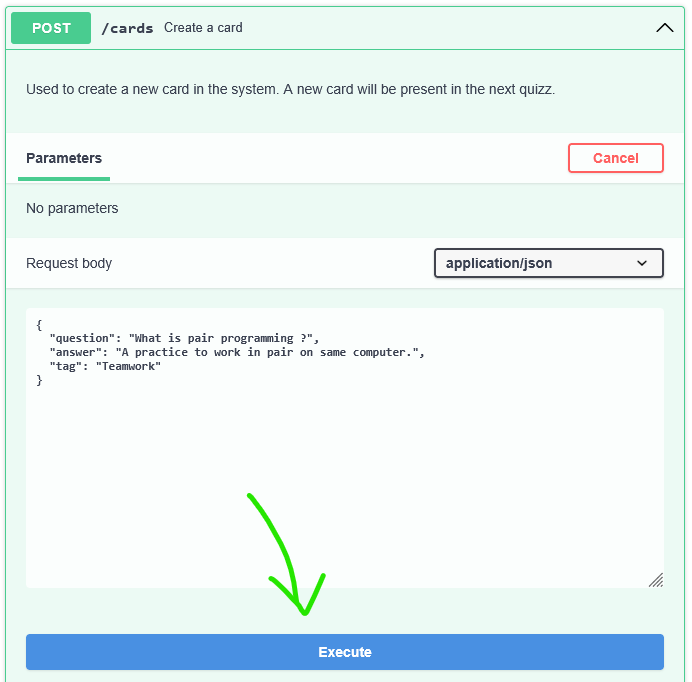

# MemoBac API

## Requirements
Make sure to have Docker installed on your machine.

## Step 1: Clone the repository
```shell
git clone https://github.com/clemzouuu/MemoBac.git
```

## Step 2: Run the Server

1. **Create and start a MySQL Database** (it will work with the server)
    ```shell
    docker-compose up --build
    ```

2. **Install the dependencies** (in a new terminal)
    ```shell
    npm install
    ```

3. **Start the development server**
    ```shell
    npm run dev
    ```

4. **Done!** The API is running on [http://localhost:8080](http://localhost:8080)
   For now, the database is empty. You can start by creating a card.

## Step 2: Play with the API

The easiest way to send HTTP requests to the server is by going to [Swagger Editor](https://editor.swagger.io/) and uploading the file [Swagger.yml](http://_vscodecontentref_/0) located at the root of this project.
The website will allow you to send properly-formatted requests to the server.

### Example: Create a New Card

- Using Swagger Editor:



- Using curl:
```shell
curl -X 'POST' \
  'http://localhost:8080/cards' \
  -H 'accept: application/json' \
  -H 'Content-Type: application/json' \
  -d '{
  "question": "What is pair programming ?",
  "answer": "A practice to work in pair on same computer.",
  "tag": "Teamwork"
}'
```

## API Endpoints

### Cards
- **Get all cards**
  - `GET /cards`
  - Query parameters: [tags](http://_vscodecontentref_/1) (optional)
  - Example: `GET /cards?tags=tag1,tag2`

- **Create a new card**
  - `POST /cards`
  - Request body:
    ```json
    {
      "question": "What is pair programming?",
      "answer": "A practice to work in pair on the same computer.",
      "tag": "Teamwork"
    }
    ```

- **~~Get cards for the day~~** (TODO)
  - `GET /cards/quizz`
  - Query parameters: `date` (optional)
  - Example: `GET /cards/quizz?date=2023-11-03`

- **~~Answer a card~~** (TODO)
  - `PATCH /cards/{cardId}/answer`
  - Request body:
    ```json
    {
      "isValid": true
    }
    ```


## Error Handling
- **Custom error middleware** is used to handle errors and send appropriate responses.

## Database
- **MySQL** is used as the database.
- **TypeORM** is used for database interactions.

## Development
- **TypeScript** is used for development.
- **Nodemon** is used for automatic server restarts during development.


